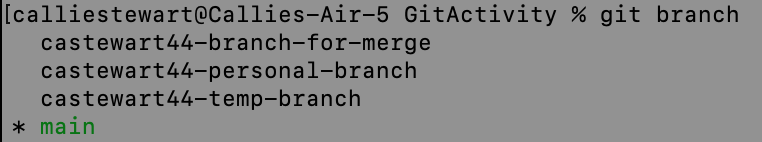

## Activity 09
### Basic operations with Git
### CSC 2310

In this lab you will perform basic operations using git. You will use the files in the repository to perform these operations.

### Pre-work
Download the lab source files using the following command:
```bash
git clone https://gitlab.csc.tntech.edu/%userid%/act09_git.git
```
replacing ``%userid%`` with your own TNTech issued userid.

### Concept

You are working on a project with many files. There are also many developers working on the project. Your goal is to maintain a productive and collaborative environment where multiple developers can submit their changes without affecting each other. In this exercise, you will clone a remote repository, create a branch, and perform other basic git operations.

### Activity
In this activity, you will be guided through a series of exercises to familiarize you with Git. You will explore the following commands, some of which you have used before in previous labs:

| command      | description |
|--------------|-------------|
| git add      | Adds changes in the working directory to the staging area, preparing them to be committed. |
| git commit   | Records changes made to the repository, creating a new commit with a unique identifier and commit message. |
| git push     | Uploads local repository commits to a remote repository, updating the remote branch with local changes. |
| git status   | Displays the current status of the working directory and staging area, showing any changes or untracked files. |
| git branch   | Creates, lists, or deletes branches within a repository. |
| git checkout | Switches between different branches or restores files from the repository to the working directory. |
| git merge    | Combines changes from one branch into another, integrating the changes and creating a new merge commit if necessary. |

For further exploration, see the [git reference guide](https://git-scm.com/docs).


#### Step 1: Creating and navigating branches
The first step for this activity is to create a series of branches to complete your work on; it's typically discouraged to complete your work on your main branch, so we will practice creating new branches and switching between them. The following command is used to create a new branch where <branch_name> is replaced with the name of your new branch:
```
git branch <branch_name>
```
And to switch branches, you use the command
```
git checkout <branch_name>
```

Alternatively, you can create a new branch and switch to it at the same time with the checkout command using the `-b` flag.
```
git checkout -b <branch_name>
```
This is shorthand for:
```
git branch <branch_name> 
git checkout <branch_name>
```

Use the above commands to create three new branches:
* <user_id>-branch-for-merge
* <user_id>-temp-branch
* <user_id>-personal_branch

You can run the command:
```
git branch
```
to see all branches where your working branch will be indicated with an `*` and highlighted.


#### Step 2: editing files and tracking changes
The next is to making changes on each branch to track the changes. 

Switch to you branch-for-merge branch. Edit the Assignment.txt file, and fill in your information for name, date, and branch. Additionally, you should add a new file to the directory by downloading the artwork for _The Lament for Icarus_ from [The Tate Modern Art Gallery](https://www.tate.org.uk/art/artworks/draper-the-lament-for-icarus-n01679). If you have trouble downloading the file, you can create text file titled Icarus.txt instead.

Next add and commit the changes with the following commands (Note: Icaus.jpg should be whatever you named your new file):
```
git add Assignment.txt
git add Icarus.jpg
git commit -m "changed Assignment, added Icarus file"
```
Now push to your branch with the command: 
```
git push --set-upstream origin <your-branch-name>
```

Now, switch to your temp branch where you will edit the Assignment.txt file again. Add, commit, and push this change using the appropriate branch name and the commit message "changed Assignment". Do not forget the `--set-upstream origin <your-branch-name>`.

Finally, switch to your personal branch and edit Assignment.txt. Additionally, add a new file by downloading _The Titan's Goblet_ from ["The Met"](https://www.metmuseum.org/art/collection/search/10499). If you cannot download the image, create a text file titled Goblet.txt instead. Add, commit, and push this change using the appropriate branch name and the commit message "changed Assignment, added Goblet file".

#### Step 3: merging and managing conflicts
In this step you will merge your temp branch with your branch for merge. Switch to your branch for merge and verify with the `git branch` command. Then use the following command to merge your temp branch into your branch for merge:
```
git merge <user_id>-temp-branch
```

**Step 1. Create TWO branches**

Once you have checked out the project, you need to create two branchs. Name these branches as follows replacing `%userid%` with your own TNTech issued userid.

```
git checkout -b "<%userid%-personal-branch>"
```

```
git checkout -b "<%userid%-branch-for-merge>"
```

Example names would be: testuser-personal-branch, testuser-branch-for-merge.  

<br/><br/>
**Step 2. Make sure to switch to the first branch**

```
git checkout "<%userid%-personal-branch>"
git branch
```
It should show a * next to your branch name.


**Step 3. Change and add a file**

Once you have created a branch, it's time to make changes.

- change the "Assignment" file. Include the following details: your name, change date, and the branch name
- create a new file named "alice_in_wonderland.pdf". You can use this publicly available [file](https://www.gutenberg.org/files/11/old/11-pdf.pdf). If you can not download, create an empty file.

<br/><br/>
**Step 4. Check the status of the new file**

Check and verify the file is not added to the repository. You can do this using "git status" command. The file shoud be shown in red.
```
git status
```

<br/><br/>
**Step 5. Add the file to them**

* Add this new file to git.
```
git add alice_in_wonderland.pdf
```

<br/><br/>
**Step 6. Check the status of the new file**

Check and verify the file is now in the repository. You can do this using "git status" command. The file should be green.
```
git status
```

<br/><br/>
**Step 7. Commit the changes**

Once you have added the file and verified it, commit the change.
```
git commit -m 'changed README, added alice in wonderland'
```

<br/><br/>
**Step 8. Push to the remote repository**
After committing, push the changes and the new branch to the remote repository.

```
git push --set-upstream origin <%your branch name>
```
You can find your branch name using 

```
git branch
```

## Section 2
In this section, we learn to merge different branches.

**Step 1:  Checkout the branch for merge**
After pushing the new branch, checkout the other branch: "<%userid%-branch-for-merge>

```
git checkout "<%userid%-branch-for-merge>"
```

An example name would be: testuser-branch-for-merge.

<br/><br/>
**Step 2:  Modify the file**
Once you have created this branch, 
* change the "README" file. Include the following details: your name, change date, and the branch name


<br/><br/>
**Step 3: Commit the changes and push**
Once you have changed the file, commit the change.
```
git commit -m 'changed README'
git push --set-upstream origin "<%userid%-branch-for-merge>"

```

<br/><br/>
**Step 4: Merge this branch with master**
Merge this branch with the master branch.
```
git checkout main
git merge "<%userid%-branch-for-merge>"

```

<br/><br/>
**Step 5: Push to the remote repository**
After merging, push the changes to the remote repository.
```
git push origin main
```

<br/><br/>
**Step 6: Remove the branch you were working on**
First, remove the local branch
```
git branch -d "<%userid%-branch-for-merge>"

```
Then, remove the remote branch
```
git push origin :"<%userid%-branch-for-merge>"

```


## Turn-in

By the end of the exercise, your gitlab repository will have two branches. One will be a branch with the README file and "alice_in_wonderland.pdf" in the assignment directory. The other branch will have just a README file in that directory.


Take the following screenshots and include them in *one* pdf file.

- Screenshot 1:
In your GitHub repository, go to "Insights" -> "Network" on the left hand menu. Take a screenshot, and attach to the submission. It should show three commits and a graph showing the branches.

- Screenshot 2: 
In your GitHub repository, go to "Insights" -> "Network" on the left hand menu.
It should show only two active branches.

- Screenshot 3:
In your GitHub repository, go to "Insights" -> "Network" on the left hand menu
Select the source as ""<%userid%-personal-branch>" and the target as "Main". DO NOT reverse the source and the target. Press the compare button, take a screenshot, and attach it to your submission. 


Put all three screenshots in a pdf file, name it according to the follwing format (%username%-screenshot.pdf) and submit to iLearn for the Activity 09 assignment.

